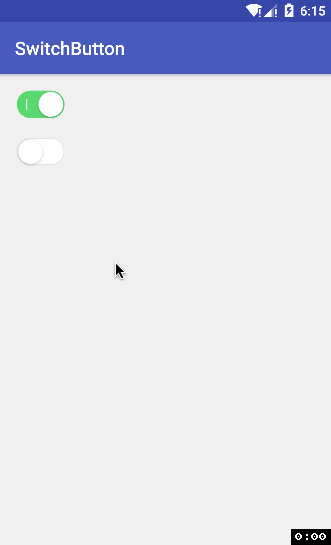

# SwitchButton
 
 

### gradle:
```groovy
dependencies {
    ...
    compile 'sing.switchbutton:library:1.0.1'
}
```
### Maven:
```xml
<dependency>
　　<groupId>sing.switchbutton</groupId>
　　<artifactId>library</artifactId>
　　<version>1.0.1</version>
　　<type>pom</type>
</dependency>
```

属性 | 描述
--- | ---
sb\_shadow\_effect | 是否启用阴影
sb\_shadow\_radius | 阴影半径
sb\_shadow\_color | 阴影颜色
sb\_shadow\_offset | 阴影向下偏移
sb\_uncheck\_color | 关闭颜色
sb\_checked\_color | 开启颜色
sb\_border\_width | 边框宽度
sb\_checkline\_color | 开启指示器颜色
sb\_checkline\_width | 开启指示器线宽
sb\_uncheckcircle\_color | 关闭指示器颜色
sb\_uncheckcircle\_width | 关闭指示器线宽
sb\_uncheckcircle\_radius | 关闭指示器半径
sb\_checked | 是否选中
sb\_effect\_duration | 动画时间，默认300ms
sb\_button\_color | 按钮颜色
sb\_show\_indicator | 是否显示指示器，默认true：显示
sb\_background | 背景色，默认白色
sb\_enable\_effect | 是否启用特效，默认true